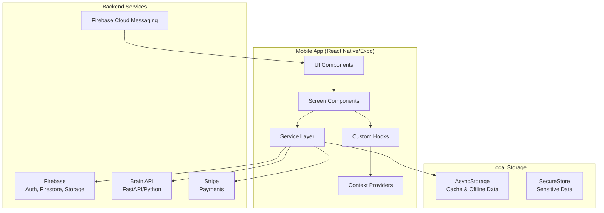

# Design Document: App Store Deployment

## Overview

This design document outlines the technical approach for ensuring the AmPac Capital mobile app is feature-complete and ready for deployment to the Apple App Store and Google Play Store. The app is built with React Native (Expo SDK ~54.0) and uses Firebase for backend services, with a Python FastAPI microservice (Brain API) for AI features.

The primary focus is on:
1. Verifying and fixing existing feature implementations
2. Ensuring robust error handling and offline support
3. Meeting App Store compliance requirements
4. Providing a polished, crash-free user experience

## Architecture



## Components and Interfaces

### Core Navigation Structure

```typescript
// Navigation hierarchy
RootStack
├── AuthStack (unauthenticated)
│   ├── OpenSplash
│   ├── Landing
│   ├── SignIn
│   └── SignUp
└── MainStack (authenticated)
    ├── MainTabs
    │   ├── HomeTab → HomeScreen
    │   ├── Apply → ApplicationScreen
    │   ├── Spaces → SpacesNavigator
    │   ├── Social → SocialHubScreen
    │   └── Support → HotlineScreen
    └── Modal Screens
        ├── Profile
        ├── DirectMessages
        ├── Chat
        ├── Payment
        ├── Calendar
        └── ...
```

### Key Service Interfaces

```typescript
// Authentication Service
interface AuthService {
  signIn(email: string, password: string): Promise<User>;
  signUp(email: string, password: string, name: string): Promise<User>;
  signOut(): Promise<void>;
  getCurrentUser(): User | null;
}

// Application Service
interface ApplicationService {
  evaluateEligibility(answers: PreQualAnswers): EligibilityResult;
  submitApplication(data: ApplicationData): Promise<Application>;
  getApplicationStatus(id: string): Promise<ApplicationStatus>;
}

// Direct Message Service
interface DirectMessageService {
  initialize(): Promise<void>;
  startConversation(targetUserId: string): Promise<string>;
  sendMessage(dmId: string, text: string): Promise<void>;
  getUserConversations(): Promise<DirectMessage[]>;
  subscribeToMessages(dmId: string, callback: MessageCallback): Unsubscribe;
  markAsRead(dmId: string): Promise<void>;
  cleanup(): void;
}

// Push Notification Service
interface PushNotificationService {
  initialize(userId: string): Promise<void>;
  requestPermissions(): Promise<boolean>;
  registerToken(): Promise<void>;
  handleNotification(notification: Notification): void;
  cleanup(): void;
}

// Assistant Service
interface AssistantService {
  chat(context: string, query: string): Promise<string>;
  getFallbackResponse(query: string, context: string): string;
}

// Offline Storage Service
interface OfflineStorageService {
  cacheData(key: string, data: any): Promise<void>;
  getCachedData<T>(key: string): Promise<T | null>;
  queueAction(action: QueuedAction): Promise<void>;
  processQueue(): Promise<void>;
  clearCache(): Promise<void>;
}
```

## Data Models

### User Model
```typescript
interface User {
  uid: string;
  email: string;
  fullName: string;
  businessName?: string;
  phone?: string;
  profileImage?: string;
  createdAt: Timestamp;
  updatedAt: Timestamp;
  notificationSettings: NotificationSettings;
}

interface NotificationSettings {
  messages: boolean;
  applications: boolean;
  community: boolean;
  marketing: boolean;
}
```

### Application Model
```typescript
interface Application {
  id: string;
  userId: string;
  status: ApplicationStatus;
  venturesStatus?: VenturesStatus;
  loanAmount: number;
  loanType: 'sba504' | 'sba7a' | 'microloan' | 'community';
  businessInfo: BusinessInfo;
  createdAt: Timestamp;
  updatedAt: Timestamp;
}

type ApplicationStatus = 
  | 'draft' 
  | 'submitted' 
  | 'under_review' 
  | 'approved' 
  | 'declined' 
  | 'withdrawn';

interface PreQualAnswers {
  isOwner: boolean;
  amount: string;
  years: string;
}

interface EligibilityResult {
  eligible: boolean;
  productType: 'standard' | 'microloan' | 'alternative';
  issues: string[];
  suggestions: string[];
}
```

### Direct Message Model
```typescript
interface DirectMessage {
  id: string;
  participants: string[];
  participantNames: string[];
  lastMessage?: {
    text: string;
    senderId: string;
    timestamp: Timestamp;
  };
  unreadCount: Record<string, number>;
  createdAt: Timestamp;
}

interface Message {
  id: string;
  dmId: string;
  senderId: string;
  senderName: string;
  text: string;
  timestamp: Timestamp;
  status: 'sending' | 'sent' | 'delivered' | 'read' | 'failed';
}
```

### Offline Queue Model
```typescript
interface QueuedAction {
  id: string;
  type: 'message' | 'report' | 'update';
  payload: any;
  createdAt: number;
  retryCount: number;
  maxRetries: number;
}
```


## Correctness Properties

*A property is a characteristic or behavior that should hold true across all valid executions of a system—essentially, a formal statement about what the system should do. Properties serve as the bridge between human-readable specifications and machine-verifiable correctness guarantees.*

### Property 1: Loan Amount Routing Correctness

*For any* loan amount entered by a user, the eligibility evaluation SHALL route to the correct product type:
- Amount < $5,000 → alternative funding suggestions
- Amount $5,000-$49,999 → micro-loan alternatives
- Amount >= $50,000 → standard SBA loan flow

**Validates: Requirements 2.3, 2.4, 2.5**

### Property 2: Invalid Credential Error Handling

*For any* invalid credential combination (empty email, malformed email, short password, etc.), the authentication flow SHALL display an error message without crashing the application.

**Validates: Requirements 1.4, 1.6**

### Property 3: Eligibility Always Offers Next Steps

*For any* eligibility evaluation result (eligible, alternative, or ineligible), the Mobile_App SHALL always provide at least one actionable next step (portal link, support contact, or alternative options).

**Validates: Requirements 2.7, 2.8**

### Property 4: Personalized Greeting Contains User Name

*For any* authenticated user with a fullName property, the home screen greeting SHALL contain the user's first name extracted from fullName.

**Validates: Requirements 3.1**

### Property 5: Events Display Limited to Maximum

*For any* number of upcoming events (0, 1, 2, 3, or more), the home screen SHALL display at most 3 events in the featured events section.

**Validates: Requirements 3.4**

### Property 6: Tool Navigation Correctness

*For any* tool card in the Tools & Services grid, tapping the card SHALL navigate to the screen specified in the tool's configuration.

**Validates: Requirements 3.6**

### Property 7: Message Delivery to Participants

*For any* message sent in a channel or direct message, the message SHALL appear in the message list for all participants of that conversation.

**Validates: Requirements 4.4**

### Property 8: DM Conversation Idempotence

*For any* pair of users (A, B), starting a direct message conversation SHALL either create a new conversation if none exists, or return the existing conversation ID. Multiple calls with the same pair SHALL return the same conversation.

**Validates: Requirements 4.6**

### Property 9: Text and Emoji Support in Chat

*For any* valid text string containing alphanumeric characters, spaces, punctuation, and emoji, the chat interface SHALL accept and display the message correctly.

**Validates: Requirements 4.7**

### Property 10: Notification Delivery for Messages

*For any* new direct message received by a user with notifications enabled, the Push_Notification_Service SHALL deliver a push notification to that user's registered device.

**Validates: Requirements 5.3**

### Property 11: Deep Link Navigation Correctness

*For any* notification with a deep link payload, tapping the notification SHALL navigate to the screen specified in the payload with the correct parameters.

**Validates: Requirements 5.4**

### Property 12: Badge Count Accuracy

*For any* user with unread messages, the app badge count SHALL equal the total number of unread messages across all conversations.

**Validates: Requirements 5.6**

### Property 13: Offline Queue Sync Round-Trip

*For any* action queued while offline, when connectivity is restored, the action SHALL be processed and the result SHALL be equivalent to performing the action while online.

**Validates: Requirements 6.2, 6.3, 6.4**

### Property 14: Retry with Exponential Backoff

*For any* failed API call, the retry mechanism SHALL attempt up to 3 retries with delays following exponential backoff pattern (e.g., 1s, 2s, 4s).

**Validates: Requirements 6.5**

### Property 15: No Crashes from Network Errors

*For any* network error (timeout, connection refused, DNS failure, etc.), the Mobile_App SHALL handle the error gracefully without crashing.

**Validates: Requirements 6.7**

### Property 16: AI Response Time Constraint

*For any* successful Brain_API response, the response SHALL be displayed to the user within 5 seconds of the query being submitted.

**Validates: Requirements 7.2**

### Property 17: AI Fallback Relevance

*For any* query about loans, applications, documents, or eligibility when the Brain_API is unavailable, the fallback response SHALL contain keywords relevant to the query topic.

**Validates: Requirements 7.3, 7.4, 7.5**

### Property 18: Payment Security

*For any* payment-related API call, the request SHALL use HTTPS protocol, and no sensitive payment information (card numbers, CVV) SHALL be stored in local storage.

**Validates: Requirements 8.5, 8.6**

### Property 19: Screen Load Time Constraint

*For any* screen in the application, the time from navigation initiation to content display SHALL be less than 3 seconds on devices meeting minimum specifications.

**Validates: Requirements 9.5**

### Property 20: Report Submission to Queue

*For any* content report submitted by a user, the report SHALL be added to the moderation queue in Firestore with the reporter ID, content ID, and reason.

**Validates: Requirements 10.2**

### Property 21: Blocked User Content Hiding

*For any* user blocked by the current user, content from the blocked user SHALL not appear in feeds, channels, or search results, and direct messaging SHALL be prevented.

**Validates: Requirements 10.3**

### Property 22: Profanity Filtering

*For any* user-generated content containing words from the profanity list, the content SHALL be filtered or flagged before display.

**Validates: Requirements 10.5**

## Error Handling

### Network Error Handling Strategy

```typescript
// Centralized error handling with retry logic
const withRetry = async <T>(
  operation: () => Promise<T>,
  options: RetryOptions = { maxRetries: 3, baseDelay: 1000 }
): Promise<T> => {
  let lastError: Error;
  
  for (let attempt = 0; attempt <= options.maxRetries; attempt++) {
    try {
      return await operation();
    } catch (error) {
      lastError = error as Error;
      
      if (attempt < options.maxRetries) {
        const delay = options.baseDelay * Math.pow(2, attempt);
        await sleep(delay);
      }
    }
  }
  
  throw lastError;
};
```

### Error Categories and User Messages

| Error Type | User Message | Action |
|------------|--------------|--------|
| Network Offline | "You're offline. Some features may be limited." | Show offline banner, use cached data |
| API Timeout | "Taking longer than expected. Please try again." | Offer retry button |
| Authentication Failed | "Invalid email or password. Please try again." | Clear password field, focus |
| Payment Failed | "Payment could not be processed: [reason]" | Show retry option |
| Server Error | "Something went wrong. Please try again later." | Log to Sentry, offer retry |

### Error Boundary Implementation

```typescript
class ErrorBoundary extends React.Component<Props, State> {
  static getDerivedStateFromError(error: Error): State {
    return { hasError: true, error };
  }

  componentDidCatch(error: Error, errorInfo: ErrorInfo) {
    // Log to Sentry
    Sentry.captureException(error, { extra: errorInfo });
  }

  render() {
    if (this.state.hasError) {
      return <ErrorFallbackScreen onRetry={this.handleRetry} />;
    }
    return this.props.children;
  }
}
```

## Testing Strategy

### Dual Testing Approach

The testing strategy combines unit tests for specific examples and edge cases with property-based tests for universal properties.

#### Unit Tests
- Test specific UI flows (sign in, sign up, navigation)
- Test edge cases (empty inputs, boundary values)
- Test error conditions (network failures, invalid data)
- Test integration points (Firebase, Stripe, Brain API)

#### Property-Based Tests
- Use `fast-check` library for TypeScript property-based testing
- Minimum 100 iterations per property test
- Each test references the design document property number
- Tag format: **Feature: app-store-deployment, Property N: [property_text]**

### Test Configuration

```typescript
// jest.config.js
module.exports = {
  preset: 'jest-expo',
  setupFilesAfterEnv: ['@testing-library/jest-native/extend-expect'],
  testMatch: ['**/*.test.ts', '**/*.test.tsx'],
  collectCoverageFrom: [
    'src/**/*.{ts,tsx}',
    '!src/**/*.d.ts',
  ],
};
```

### Property Test Example

```typescript
import * as fc from 'fast-check';

// Feature: app-store-deployment, Property 1: Loan Amount Routing Correctness
describe('Loan Amount Routing', () => {
  it('routes to correct product type based on amount', () => {
    fc.assert(
      fc.property(fc.float({ min: 0, max: 10000000 }), (amount) => {
        const result = evaluateEligibility({ isOwner: true, amount: String(amount), years: '3' });
        
        if (amount < 5000) {
          expect(result.productType).toBe('alternative');
        } else if (amount < 50000) {
          expect(result.productType).toBe('microloan');
        } else {
          expect(result.productType).toBe('standard');
        }
      }),
      { numRuns: 100 }
    );
  });
});
```

### E2E Test Coverage

Using Playwright for end-to-end testing:
- Authentication flows
- Loan application pre-qualification
- Social hub messaging
- Payment flows
- Offline mode behavior

### Test Priorities for App Store Submission

1. **Critical Path Tests** (Must Pass)
   - App launches without crash
   - Authentication works
   - Core navigation functions
   - No memory leaks

2. **Feature Tests** (Should Pass)
   - Loan application flow
   - Messaging functionality
   - Payment processing
   - Push notifications

3. **Edge Case Tests** (Nice to Have)
   - Offline mode
   - Error recovery
   - Performance under load
