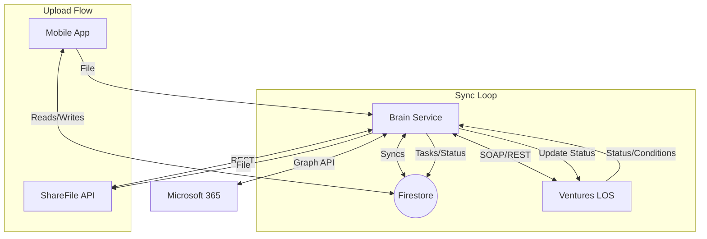

# Implementation Plan: Integrated Borrower Portal

This document outlines the technical steps to build the Integrated Borrower Experience, connecting the Mobile App to Ventures (LOS), ShareFile, and Microsoft Teams via the "Brain" middleware.

## Phase 1: Ventures Connectivity & Status Sync

*Goal: Give the borrower visibility into their loan status without manual staff updates.*

### 1.1. Backend (Brain - Python)

- [ ] **Enhance `VenturesClient`**:
  - Implement `get_loan_detail(loan_id)`: Fetch status, loan amount, and key dates.
  - Implement `get_conditions(loan_id)`: Fetch underwriting conditions (tasks).
  - Implement `get_entities(tax_id)`: Search for existing borrower records.
- [ ] **Status Mapping Logic**:
  - Create a mapping dictionary in `app/core/config.py` translating Ventures Status IDs to App Status Enums (e.g., `StatusID: 40` -> `ApplicationStatus.UNDERWRITING`).
- [ ] **Sync Engine (`app/services/sync_service.py`)**:
  - Create a background job (using `APScheduler` or simple loop) that:
    1. Queries Firestore for active `Applications` with a `venturesLoanId`.
    2. Calls Ventures API for each.
    3. Updates the Firestore `Application` document if the status has changed.
    4. Triggers a Firebase Cloud Message (FCM) notification on change.

### 1.2. Firestore Schema Updates

- [ ] **`applications` collection**:
  - Add `venturesLoanId` (string).
  - Add `venturesStatus` (string, raw status from LOS).
  - Add `lastSyncedAt` (timestamp).

### 1.3. Frontend (Mobile - React Native)

- [ ] **"Pizza Tracker" Component**:
  - Create `LoanStatusTracker.tsx` visualizing the stages: `Draft -> Submitted -> Underwriting -> Approved -> Funded`.
  - Animate the current active stage.
- [ ] **Home Screen Update**:
  - Replace the static "Current Status" card with the dynamic Tracker component.

---

## Phase 2: Bi-Directional Tasks & ShareFile

*Goal: Automate the "Condition -> Task -> Upload" loop.*

### 2.1. Backend (Brain)

- [ ] **ShareFile Client (`app/services/sharefile_client.py`)**:
  - Implement OAuth flow for ShareFile API.
  - Implement `ensure_folder_structure(borrower_name, loan_id)`: Creates `Clients/{Name}/{LoanID}/Conditions`.
  - Implement `upload_file(file_stream, path)`.
- [ ] **Task Sync Logic**:
  - In the Sync Engine, compare Ventures "Conditions" with Firestore `Tasks`.
  - **New Condition in Ventures** -> Create `Task` in Firestore (Type: `upload_document`).
  - **Condition Satisfied in Ventures** -> Mark Firestore `Task` as `completed`.

### 2.2. API Endpoints (`app/api/routers/documents.py`)

- [ ] **`POST /documents/upload`**:
  - Accepts file upload + `taskId`.
  - Uploads file to ShareFile.
  - Updates Firestore `Task` status to `in_review`.
  - Updates Ventures Condition status to `Received`.

### 2.3. Frontend (Mobile)

- [ ] **Task List UI**:
  - Update `ApplicationScreen.tsx` to render `Tasks` synced from Firestore.
  - "Upload" button on a task triggers the document picker.
- [ ] **Camera Integration**:
  - Use `expo-image-picker` or `react-native-vision-camera` for scanning documents directly into the upload flow.

---

## Phase 3: Teams & Communication

*Goal: Connect the borrower to the human Loan Officer.*

### 3.1. Backend (Brain)

- [ ] **Graph Client (`app/services/graph_service.py`)**:
  - Use `msgraph-sdk` to authenticate as the App (Service Principal) or on behalf of the assigned Staff.
  - Implement `find_meeting_times(staff_email, duration_minutes)`.
  - Implement `create_online_meeting(subject, start_time, end_time, attendees)`.

### 3.2. Frontend (Mobile)

- [ ] **"My Loan Officer" Card**:
  - Display the assigned staff member's photo and name (from Firestore `users` collection).
- [ ] **Chat Interface**:
  - **Option A (Deep Link)**: Button "Chat in Teams" opens the MS Teams app to a specific chat.
  - **Option B (Embedded)**: Simple chat UI in React Native that writes to a Firestore sub-collection `messages`. A Cloud Function or Brain job syncs these messages to the Teams Chat via Graph API. (Start with Option A for MVP).
- [ ] **Scheduling UI**:
  - `ScheduleMeetingScreen.tsx`:
    - Fetches available slots from `Brain`.
    - User selects a slot.
    - `Brain` books it and returns the Teams Meeting Link.

---

## Architecture Diagram

## Immediate Next Steps

1. **Ventures Access**: Obtain API credentials (SOAP WSDL or REST endpoint) for the Ventures sandbox.
2. **ShareFile Access**: Create an API Key/Client Secret in the ShareFile developer portal.
3. **Scaffold Brain Services**: Create the empty service files in `apps/brain/app/services/` to start implementing the clients.
